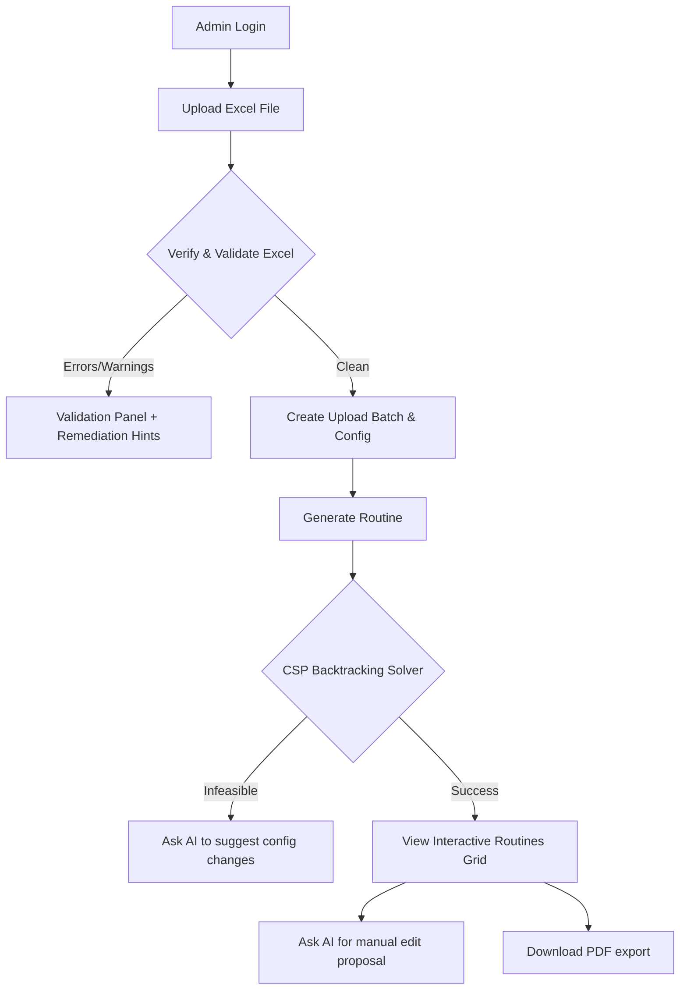

# CSE Routine Generator

A complete full-stack web application designed to automate the creation of collision-free weekly class routines for university departments. It takes an uploaded Excel configuration (detailing teachers, courses, rooms, credit rules, preferences, and unavailability), passes it through a deterministic **Backtracking CSP (Constraint Satisfaction Problem) Solver** written in plain JavaScript, and renders an interactive timetable grid. The generated routine is exportable as a publication-ready PDF document.

---

## Tech Stack Overview

- **Frontend**: React (Vite), Tailwind CSS, Lucide Icons, Axios, React Hot Toast.
- **Backend**: Node.js, Express, MySQL (`mysql2` pool).
- **File Parsing**: SheetJS (`xlsx`) for reading Excel workbooks.
- **PDF Generation**: `docx` library (programmatic layout construction) converted to PDF via headless `libreoffice`.
- **AI Integration**: Groq/Gemini API (via OpenAI-compatible chat completions interface) for diagnostic hints, manual edit parsing, and failure explanations.

---

## System Architecture & Flow



---

## Database Architecture (MySQL)

The system uses a relational MySQL database containing the following tables:

1. **`upload_batches`**: Tracks uploaded Excel configurations, validation status, error/warning logs, and timestamps.
2. **`teachers`**: Stores teacher names, department, designation, and unique abbreviations.
3. **`courses`**: Stores courses with credit count, year-semester mappings, and derived constraints (durations, sessions per week).
4. **`rooms`**: List of classrooms and labs.
5. **`credit_rules`**: Defines the weekly class count and duration based on course credit weight (e.g. 50 mins/slot for theory, 100/150 mins for labs).
6. **`room_preference`**: Probabilistic room selection weights per year group (Years 1-2 vs. Years 3-4).
7. **`teacher_unavailability`**: Restricts specific weekdays and timeslots for individual teachers.
8. **`config`**: Key-value settings containing university header metadata, workdays, class starts/ends, and break times.
9. **`schedules`**: Stores the computed sessions (course, teacher, room, day, slot start, slot end).
10. **`users`**: Manages hashed credentials for admin route authentication.

---

## Installation & Local Setup

### 1. Prerequisites
- **Node.js** (v18+)
- **MySQL Server**
- **LibreOffice** (required to compile and stream PDF files on the backend via the command line)

### 2. Database Migration
Create a MySQL database named `routine_generator` (or matching `DB_NAME` in `.env`) and run the migrations:
```bash
cd backend
npm install
npm run migrate
```
*Note: This creates the default database structure and seeds the administrator account.*

### 3. Environment Variables (`backend/.env`)
Create a `.env` file inside `backend/` with the following configuration:
```env
DB_HOST=localhost
DB_PORT=3306
DB_USER=cse_admin
DB_PASSWORD=YourPassword
DB_NAME=routine_generator

PORT=4000
SCHEDULER_BUDGET=2000000

# Optional: Groq/Gemini API key for AI assistant features
GROQ_API_KEY=your_groq_api_key
GROQ_MODEL=llama-3.3-70b-versatile
GROQ_BASE_URL=https://api.groq.com/openai/v1
GROQ_TIMEOUT_MS=6000
```

### 4. Running the Development Servers
Open two terminal windows to launch the client and server locally:

**Start Backend API Server (Port 4000)**:
```bash
cd backend
npm run dev
```

**Start Vite Frontend Dev Server (Port 5173)**:
```bash
cd client
npm install
npm run dev
```

---

## Default Administrative Credentials

Access to scheduling, uploading, and exporting routes requires logging in using:
- **Email**: `admin_cse@gmail.com`
- **Password**: `12345678`

---

## Deterministic Backtracking CSP Solver

The core routine generator solver (`backend/src/services/scheduler.js`) implements a deterministic Constraint Satisfaction Problem (CSP) backtracking solver:

1. **Variables**: Course sessions derived from credit rules.
2. **Domains**: Combines valid work days, daily 50-minute slot times, and eligible rooms of correct type (classrooms for theory, labs for practicals).
3. **Unary Constraints**: Discards domains that overlap with teacher unavailability windows.
4. **Binary Constraints (Resource Collisions)**: Enforces that:
   - No teacher is double-booked.
   - No room is double-booked.
   - No year-semester group (e.g. `4-1`) is assigned multiple classes in the same slot.
5. **Heuristics**:
   - **MRV (Minimum Remaining Values)**: Sorts courses by constraint tightness (higher weekly demand, fewer rooms, more sessions) to schedule hard-to-fit sessions (e.g., long lab slots) first.
6. **Lookahead Pruning**: Checks remaining weekdays vs. remaining sessions for each course. If the days are fewer than sessions, it backtracks early to prevent searching infeasible subtrees.
7. **Lab Block Splitting**: Multi-credit lab courses are split into consecutive 50-minute segments. The solver verifies that consecutive blocks on a single day have the room, teacher, and group all free before assigning them.

---

## AI Assistant Layer (LLM Integration)

The application utilizes an LLM (such as Llama 3.3 or Gemini via `GROQ_API_KEY`) behind `aiProvider.js` for presentation and helper duties. **AI is never on the critical path of routing decisions**:

- **Remediation Explanations**: Translates Excel schema errors or warning codes into friendly, actionable advice with a "How do I fix this?" button.
- **Manual Edit Proposal Parsing**: Translates free-text requests (e.g., *"Move CSE406 to Monday 9:00 AM"*) into validated, structured change suggestions.
- **Infeasibility Troubleshooting**: Explains why a configuration cannot be solved (e.g. teacher time overload or classroom shortfalls) and suggests options.
